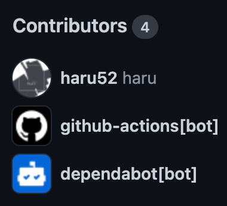
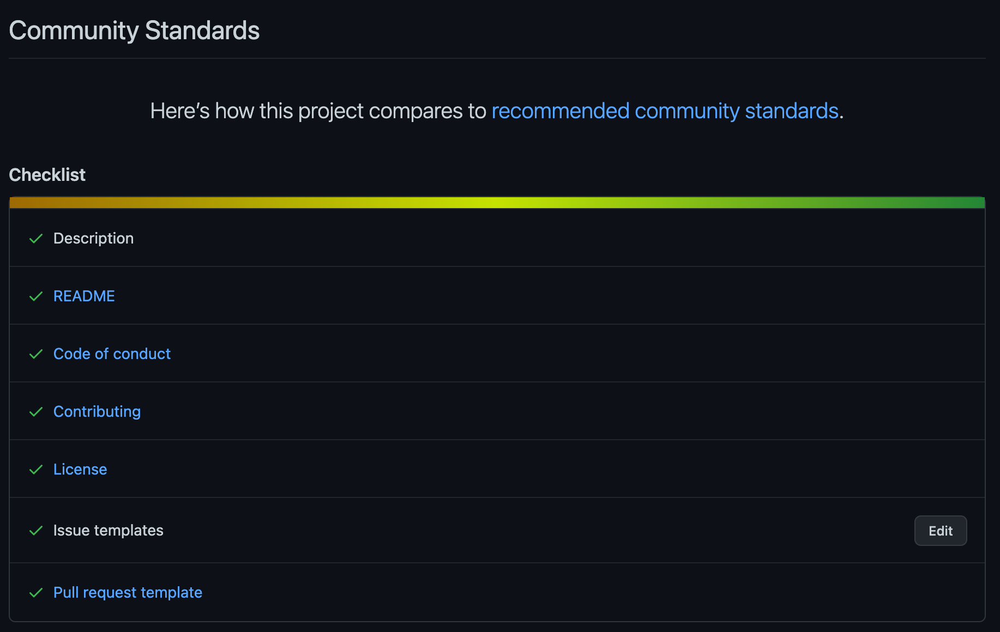
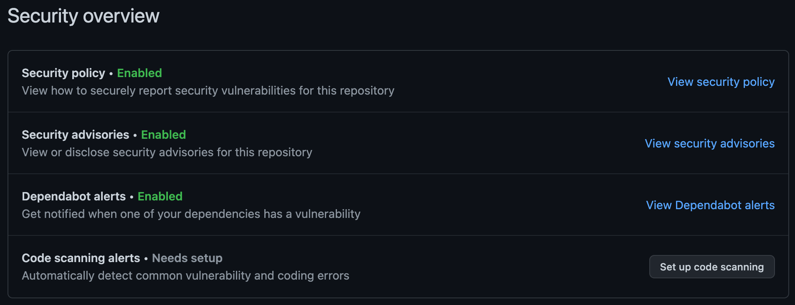

# ベーステンプレートリポジトリ

## 概要

完全に自動化されたテンプレートリポジトリです。お望みのままにこのテンプレートを利用、拡張、カスタマイズすることができます！

このテンプレートは [GitHub コミュニティスタンダード](https://github.com/haru52/base_template_ja/community)に完全準拠しています。このテンプレートはリポジトリ初期化フェーズにおける定型的なファイルの追加という苦痛を取り除きます ☺️

## 動作要件

- GitHub アカウント

## インストール

特になし！

## 利用方法

1. GitHub で当リポジトリのページを開く
2. `Use this template` ボタンをクリック
3. お疲れ様でした！これにて快適な環境でコーディングする準備が整いました 🎉

## アップデート

当テンプレートを元に作成したリポジトリへ最新のベーステンプレートのファイルを適用するには、[Base Template CLI][base-template-cli] をご利用ください。

## アンインストール

特になし。

## 詳細

### 技術スタック

|            カテゴリー             |                                        ツール                                         |
| --------------------------------- | ------------------------------------------------------------------------------------- |
| IDE／エディタ設定                 | [EditorConfig](https://editorconfig.org/)                                             |
| .gitignore 管理                   | [gibo](https://github.com/simonwhitaker/gibo#readme)                                  |
| Git フック                        | [Husky](https://typicode.github.io/husky)                                             |
| Git コミット I/F                  | [Commitizen](https://commitizen.github.io/cz-cli/)                                    |
| CI/CD                             | [GitHub Actions](https://github.com/features/actions)                                 |
| コードレビュー                    | [reviewdog](https://github.com/reviewdog/reviewdog#readme)                            |
| リリース                          | [semantic-release](https://semantic-release.gitbook.io/semantic-release/)             |
| 依存性更新                        | [Dependabot](https://docs.github.com/ja/code-security/dependabot)                     |
| Lint：Git ステージ                | [lint-staged](https://github.com/okonet/lint-staged#readme)                           |
| Lint：Git コミットメッセージ      | [commitlint](https://commitlint.js.org/)                                              |
| Lint：クレデンシャル              | [Secretlint](https://github.com/secretlint/secretlint#readme)                         |
| Lint：Markdown                    | [markdownlint-cli](https://github.com/igorshubovych/markdownlint-cli#readme)          |
| Lint：テキスト（散文）            | [textlint](https://textlint.github.io/)                                               |
| Lint：YAML                        | [yamllint](https://yamllint.readthedocs.io/)                                          |
| Lint：シェルスクリプト            | [ShellCheck](https://github.com/koalaman/shellcheck#readme)                           |
| Lint：JSON、その他                | [Prettier](https://prettier.io/)                                                      |
| Lint：GitHub Actions ワークフロー | [actionlint](https://github.com/rhysd/actionlint#readme)                              |
| Lint：GitHub PR タイトル          | [semantic-pull-request](https://github.com/marketplace/actions/semantic-pull-request) |

### コミュニティスタンダード

### セキュリティ

なぜ `Code scannig alerts` 機能が有効になっていないのでしょうか？それは、このリポジトリにはスキャン対象となるコードが存在しないためです！もちろん、あなたのプロジェクトに応じてこの機能をセットアップすることもできます。

### トラブルシューティング

この方法で問題が解決しない場合、[issue を作成](https://github.com/haru52/base_template_ja/issues/new/choose)してください。

#### CI が失敗する

1. `https://github.com/<org>/<repo>/settings/actions` を開く
2. `Workflow permissions` 設定の `Read and write permissions` オプションが選択されていない場合はこれを選択
3. `Allow GitHub Actions to approve pull requests` がチェックさていない場合はこれをチェック
4. `Save` ボタンをクリック

### 既存リポジトリへのテンプレート適用

[Base Template CLI][base-template-cli] をご利用ください。

## バージョニングポリシー

[セマンティック バージョニング 2.0.0](https://semver.org/lang/ja/spec/v2.0.0.html)

## ライセンス

[WTFPL](LICENSE)

## 言語

- [English](https://github.com/haru52/base_template#readme)（本家）
- 日本語（当リポジトリ）

## コントリビューション

[コントリビューティングガイドライン](CONTRIBUTING.md)

## 作者

[haru](https://haru52.com/)

[base-template-cli]: https://github.com/haru52/base_template_cli#readme
