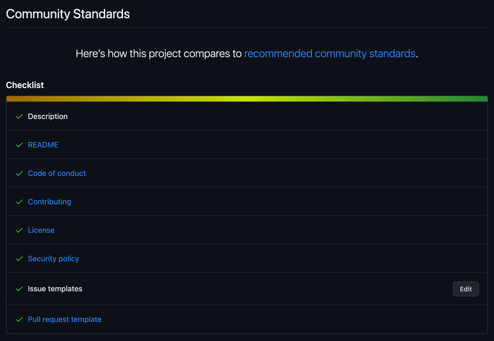

# ベーステンプレートリポジトリ

## 概要

完全に自動化されたテンプレートリポジトリです。お望みのままにこのテンプレートを利用、拡張、カスタマイズすることができます！

このテンプレートは[GitHubコミュニティスタンダード](https://github.com/haru52/base_template_ja/community)に完全準拠しています。このテンプレートはリポジトリ初期化フェーズにおける定型的なファイルの追加という苦痛を取り除きます ☺️

## 動作要件

|                           ツール                            |                      バージョン                      |
| ----------------------------------------------------------- | ---------------------------------------------------- |
| GitHubアカウント                                            |                                                      |
| Node.js, npm                                                | [package.json](package.json) における `engines` の値 |
| [gibo](https://github.com/simonwhitaker/gibo#readme)        | >=2.2.7                                              |
| [ShellCheck](https://github.com/koalaman/shellcheck#readme) | >=0.8.0                                              |
| [actionlint](https://github.com/rhysd/actionlint#readme)    | [.tool-versions](.tool-versions)                     |

## インストール

特になし！

## 利用方法

1. GitHubでこのリポジトリのページを開く
2. `Use this template` ボタンをクリック
3. リポジトリが作成されたら `https://github.com/<org>/<repo>/settings/actions` を開く
4. `Workflow permissions` 設定の `Read and write permissions` オプションが選択されていない場合はこれを選択する。また、`Allow GitHub Actions to approve pull requests` がチェックさていない場合はこれをチェックし、`Save` ボタンをクリック
5. お疲れ様でした！これにて快適な環境でコーディングする準備が整いました 🎉

## 詳細

### 技術スタック

|            カテゴリー            |                                    ツール                                    |
| -------------------------------- | ---------------------------------------------------------------------------- |
| IDE／エディタ設定                | [EditorConfig](https://editorconfig.org/)                                    |
| .gitignore管理                   | [gibo](https://github.com/simonwhitaker/gibo#readme)                         |
| Gitフック                        | [Husky](https://typicode.github.io/husky)                                    |
| GitコミットI/F                   | [Commitizen](https://commitizen.github.io/cz-cli/)                           |
| CI/CD                            | [GitHub Actions](https://github.com/features/actions)                        |
| コードレビュー                   | [reviewdog](https://github.com/reviewdog/reviewdog#readme)                   |
| リリース                         | [semantic-release](https://semantic-release.gitbook.io/semantic-release/)    |
| 依存パッケージ更新               | [Dependabot](https://docs.github.com/en/code-security/dependabot)            |
| Lint：Gitステージ                | [lint-staged](https://github.com/okonet/lint-staged#readme)                  |
| Lint：Gitコミットメッセージ      | [commitlint](https://commitlint.js.org/)                                     |
| Lint：クレデンシャル             | [Secretlint](https://github.com/secretlint/secretlint#readme)                |
| Lint：Markdown                   | [markdownlint-cli](https://github.com/igorshubovych/markdownlint-cli#readme) |
| Lint：テキスト（散文）           | [textlint](https://textlint.github.io/)                                      |
| Lint：シェルスクリプト           | [ShellCheck](https://github.com/koalaman/shellcheck#readme)                  |
| Lint：YAML、その他               | [Prettier](https://prettier.io/)                                             |
| Lint：GitHub Actionsワークフロー | [actionlint](https://github.com/rhysd/actionlint#readme)                     |

### コミュニティスタンダード

### セキュリティ

なぜ `Code scannig alerts` 機能がセットアップされていないのでしょうか？それは、このリポジトリにはスキャン対象となるコードが存在しないためです！もちろん、あなたのプロジェクトに応じてこの機能をセットアップすることもできます。

## バージョニング

[セマンティック バージョニング 2.0.0](https://semver.org/lang/ja/spec/v2.0.0.html)

## ライセンス

[WTFPL](LICENSE)

## 言語

- [English](https://github.com/haru52/base_template#readme)（本家）
- 日本語（当リポジトリ）

## コントリビューション

[コントリビューティングガイドライン](CONTRIBUTING.md)

## 作者

[haru](https://haru52.com/)
